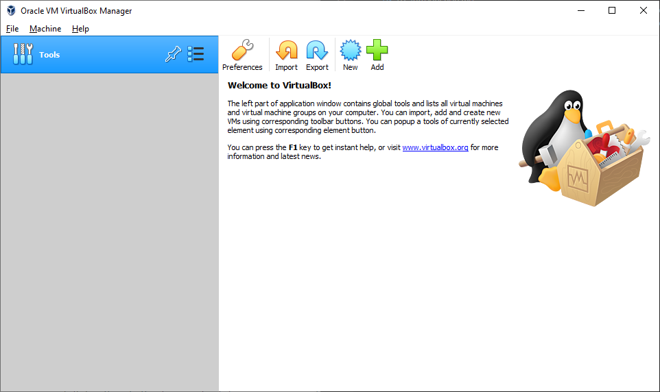
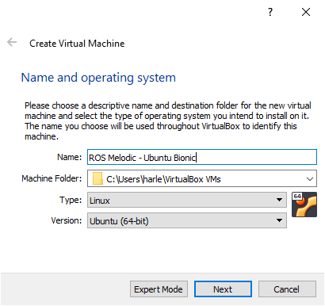
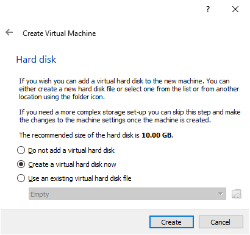
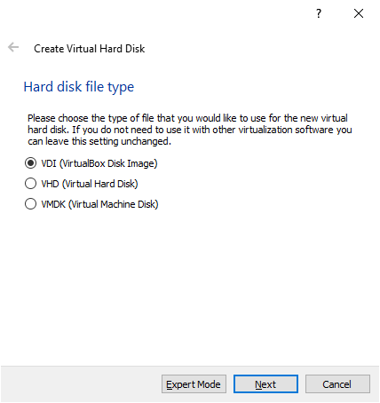
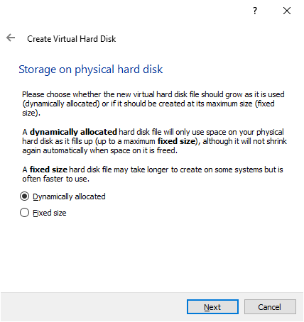
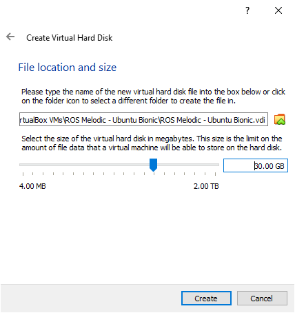
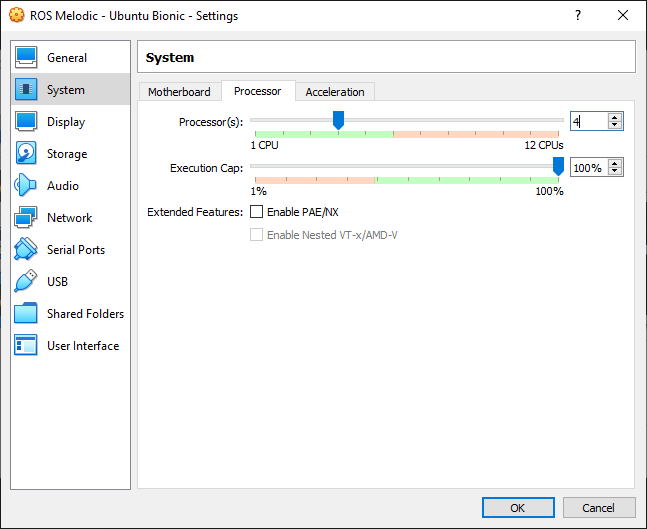
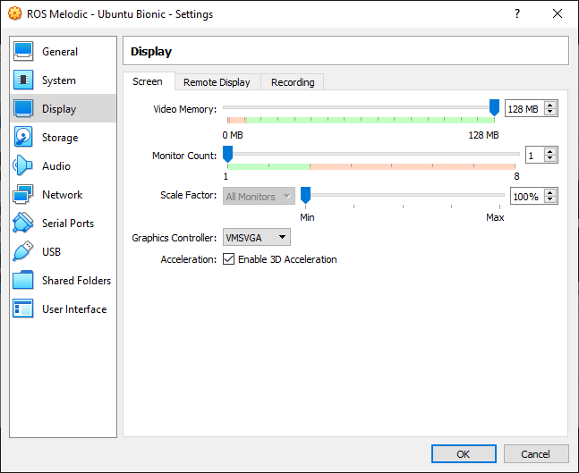
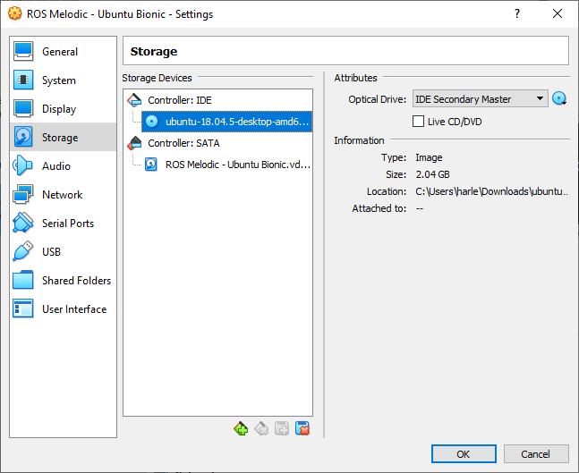

# Instalación de Ubuntu 18.04 (Bionic Beaver) en Virtual Box para simulación de drones

## Descargar Ubuntu 18.04 LTS (Bionic Beaver)

Descarga Ubuntu 18.04 LTS en formato ISO desde esta [página](https://releases.ubuntu.com/).

## Oracle VM VirtualBox

### Descarga e Instalación de Oracle VirtualBox

Descarga e instala VirtualBox, puedes descargarlo desde este [enlace](https://www.virtualbox.org/wiki/Downloads), selecciona el instalador correcto para tu sistema operativo, ya sea Windows, Linux o MacOs.

> Nota: Si tu computadora ya está utilizando **Ubuntu 18.04 LTS (Bionic Beaver)** puedes omitir la instlación de _Oracle VM VirtualBox_

### Configuración de la máquina virtual

Abre VirtualBox.

Presiona el boton "New", escribe un nombre para la máquina virtual y selecciona el tipo de sistema operativo y la versión.

Basado en esta [páguina](https://help.ubuntu.com/community/Installation/SystemRequirements) los requerimientos mínimos para ubuntu desktop son 4 GB de RAM, entonces escribimos 4000 MB en el tamaño de memoria.

Marca "Create a virtual hard disk now"

Seleciona "VDI (VirtualBox Disk Image)"

Elige "Dynamic allocated".

Basado en la páguina de [requerimientos de Ubuntu](https://help.ubuntu.com/community/Installation/SystemRequirements) escribe 30 GB para el tamaño del disco duro virtual.

Debido a que trabajaremos con un simulador dentro de la máquina virtual,debemos agregar algunas configuraciones extras para tener un rendimiento optimo del simulador.

En las configuraciones de la máguina virtual en la sección _System_ en la pestaña _Processor_ subimos la cantidad de nucleos a 4.

En la misma ventana de configuración en la sección _Display_ en la pestaña _Screen_ subimos la cantidad de memoria al máximo, el controlador de graficos seleccionamos **VMSVGA** y habilitamos la aceleración 3D.

En este punto la máquina virtual está configurada, pero aún no tiene un sistema operativo instalado, por eso ahora debemos agregar la imagen ISO del sistema operativo que descargamos anteriormente.

Finalmente presiona "Start" para iniciar la instalación de el sistma operativo Linux Ubuntu.

## Ubuntu 18.04 LTS

Accede a este [enlace](https://ubuntu.com/tutorials/install-ubuntu-desktop#5-prepare-to-install-ubuntu) para ver una guia de instalación.
