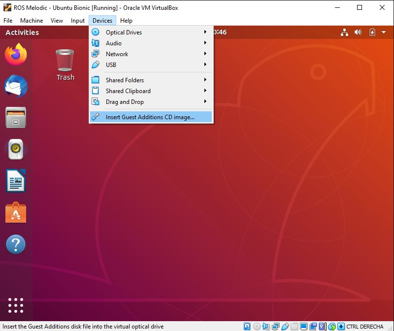

# Software previos antes de configurar el entorno de simulación

## Guest Additions para mejorar la experecian en VirtualBox

Para agregar algunas funcionalidades extrás en VirtualBox debemos instalar _Guest Additions_.

es necesario reiniciar la máquina virtual para aplicar los cambios.

## Instalar Terminator Terminal

Terminator es una terminal con funcionalidades extras que harán más comodo el trabajo, ya que cuando usemos el simulador y otras herramientas debemos abrir varias terminales y es bastante tedioso abrirlas como ventanas o pestañas.

Para instalar terminator abre el terminal y escribe:

    $ sudo apt-get update
    $ sudo apt-get install terminator

## Instalar Git

Git es un sistema de control de versiones que usaremos para instalar algunas herramientas.

    $ sudo apt-get install git

## Instalar Visual Studio Code

Visual Studio Code es un editor de código open-source multiplataforma en el cual se pueden instalar muchas extensiones muy útiles al momento de trabajar con proyectos de código.

    $ sudo snap install --classic code
