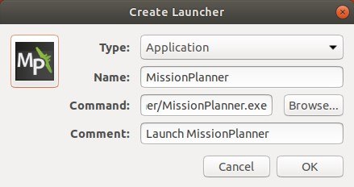
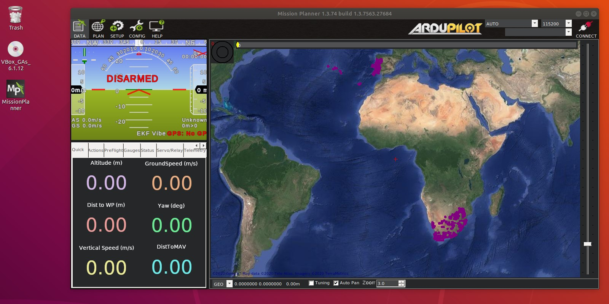

# Instalación de Mission Planner en Linux

## Instalar Mono para Linux 18.04

    $ sudo apt install gnupg ca-certificates
    $ sudo apt-key adv --keyserver hkp://keyserver.ubuntu.com:80 --recv-keys 3FA7E0328081BFF6A14DA29AA6A19B38D3D831EF
    $ echo "deb https://download.mono-project.com/repo/ubuntu stable-bionic main" | sudo tee /etc/apt/sources.list.d/mono-official-stable.list
    $ sudo apt update
    $ sudo apt install mono-devel

## Instalar Mission Planner

Descarga el archivo `MissionPlanner-latest.zip` que corresponde a la última versión de Mission Planner que puedes encontrar en este [enlace](https://firmware.ardupilot.org/Tools/MissionPlanner/), o puedes usar el siguiente comando para descargarlo directo en la carpeta `Downloads`.

    $ cd ~/Downloads && wget https://firmware.ardupilot.org/Tools/MissionPlanner/MissionPlanner-latest.zip

Si el archivo `MissionPlanner-latest.zip` de descargó en la capeta `Downloads` puedes usar los siguientes comandos para copiarlo a otra ruta y descomprimirlo allí.

    $ cd ~/Downloads
    $ cp MissionPlanner-latest.zip ~
    $ sudo apt-get install unzip
    $ unzip MissionPlanner-latest.zip -d ~/MissionPlanner
    $ cd ~/MissionPlanner

Si seguiste los comandos anteriores solo debes ejecutar los siguientes para instalar MissionPlaner. En caso que decidiste descomprimir el archivo en otra ruta asegúrate de cambiar a esa ruta antes de ejecutar los siguientes comandos.

    $ sudo apt-get remove modemmanager -y
    $ sudo usermod -a -G dialout $USER
    $ chmod +x MissionPlanner.exe
    $ mono MissionPlanner.exe

Listo! Mission Planner ahora está instalado en el sistema operativo. Para abrirlo recuerda usar el comando `mono MissionPlanner.exe`, si seguiste los pasos de descompresión anteriores y NO lo tienes en una ruta personaliza el siguiente comando puede abrirlo cada vez que lo necesites.

    $ cd ~/MissionPlanner/ && mono MissionPlanner.exe

## Crear acceso directo

Además puedes crear una acceso directo en el escritorio.

    $ sudo apt-get install --no-install-recommends gnome-panel
    $ gnome-desktop-item-edit --create-new ~/Desktop

Los comandos anteriores abriran una ventana en el que debes escribir lo siguiente.

- **Type:** Application
- **Name:** MissionPlanner
- **Command:** `mono /home/rosmelodic/MissionPlanner/MissionPlanner.exe`
- **Comment:** Launch MissionPlanner

